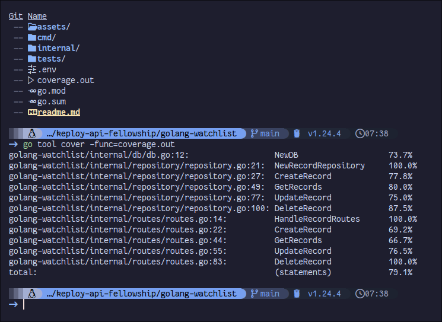

# 🎌 Anime Watch List API

> A clean, simple RESTful API to manage your anime watch list with Go and MySQL

[](https://golang.org/)
[](https://www.mysql.com/)
[](https://www.docker.com/)
[](https://github.com/utkarshkrsingh/keploy-api-fellowship)

## 🛠️ Tech Stack

This project is built with:

- **[Gorilla Mux](https://github.com/gorilla/mux)** - HTTP router and URL matcher
- **Go's database/sql** - Standard database interface
- **[MySQL Driver](https://github.com/go-sql-driver/mysql)** - MySQL database driver
- **Docker** - Container platform for database


## 🚀 Quick Start

### Prerequisites

Make sure you have these installed:
- [Go](https://golang.org/dl/) (v1.24.2 or higher)
- [Docker](https://www.docker.com/get-started)

### Installation

1. **Clone the repository**
   ```bash
   git clone https://github.com/utkarshkrsingh/keploy-api-fellowship.git
   cd keploy-api-fellowship/golang-watchlist/
   ```

2. **Start the MySQL database**
   ```bash
   docker run -d \
     --name mysql-anime-watch-list \
     --network mysql-network \
     -e MYSQL_ROOT_PASSWORD=qwerty \
     -e MYSQL_DATABASE=anime-watch-list \
     -p 5010:3306 \
     mysql
   ```

3. **Run the API server**
   ```bash
   go mod tidy
   go run ./cmd/server
   ```

🎉 **You're all set!** The API is now running at `http://localhost:8080`

## 🧪 Testing

This project maintains high code quality with comprehensive testing across multiple layers.

### **Coverage Achievement**: **79.1% Total Coverage** 📊

### **Testing Strategy**:
- **Unit Tests**: Core business logic validation with mocking and database integration
- **Integration Tests**: Database interaction verification for CRUD operations  
- **API Tests**: End-to-end endpoint functionality validation

### Test Database Setup

For non-mocking unit tests, we use a dedicated test database container:

```bash
docker run -d \
--name mysql-anime-watch-list-test \
--network mysql-network \
-e MYSQL_ROOT_PASSWORD=testqwerty \
-e MYSQL_DATABASE=test-anime-watch-list \
-p 5011:3306 \
mysql
```

### Test Structure

The project includes three types of tests:

#### 🔗 API Tests (`./tests/api`)
End-to-end tests that verify the complete API functionality:
- `TestAPICreateAndGet` - Tests creation and retrieval workflows
- `TestAPIUpdateBook` - Tests updating anime records
- `TestAPIDeleteRecord` - Tests deletion functionality

#### 🔄 Integration Tests (`./tests/integration`)
Tests that verify component interaction with the database:
- `TestCreateAndGetRecord` - Database integration for CRUD operations
- `TestUpdateRecord` - Update operations with real database
- `TestDeleteRecord` - Deletion with database verification

#### 🎯 Unit Tests (`./tests/unit`)
Isolated tests for individual components with both mocking and database testing:

**Mock Tests:**
- `TestCreateRecord_Mock` - Tests record creation with various scenarios
- `TestGetRecord_Mock` - Tests record retrieval
- `TestUpdateRecord_Mock` - Tests update operations with error handling
- `TestDeleteRecord_Mock` - Tests deletion with error scenarios

**Database Tests:**
- `TestCreateRecordRepository_Database` - Repository layer testing
- `TestGetRecord_Database` - Database query verification
- `TestUpdateRecord_Database` - Update operation testing
- `TestDeleteRecord_Database` - Deletion verification

### Running Tests

#### Run All Tests with Coverage
```bash
go test -v -coverpkg=./internal/db,./internal/routes,./internal/models,./internal/repository ./tests/... -coverprofile=coverage.out
```

#### Generate HTML Coverage Report
```bash
go tool cover -html=coverage.out -o coverage.html
```

#### View Function-Level Coverage
```bash
go tool cover -func=coverage.out
```

### **Detailed Coverage Breakdown**:

| Component | Function | Coverage | Description |
|-----------|----------|----------|-------------|
| **Database** | `NewDB` | 73.7% | Database connection and initialization |
| **Repository** | `NewRecordRepository` | 100.0% | Repository pattern implementation |
| | `CreateRecord` | 77.8% | Anime creation logic |
| | `GetRecords` | 80.0% | Data retrieval operations |
| | `UpdateRecord` | 75.0% | Anime update functionality |
| | `DeleteRecord` | 87.5% | Deletion operations |
| **Routes** | `HandleRecordRoutes` | 100.0% | Route handler setup |
| **API Handlers** | `CreateRecord` endpoint | 69.2% | Record creation API |
| | `GetRecords` endpoint | 66.7% | Data retrieval API |
| | `UpdateRecord` endpoint | 76.5% | Update operations API |
| | `DeleteRecord` endpoint | 100.0% | Deletion API |



### **Testing Tools & Frameworks**:
- Go's built-in testing package for unit tests
- Database mocking for isolated testing
- HTTP testing for API endpoint validation
- Coverage analysis with `go tool cover`
- Docker containers for test database isolation

### **Key Testing Features**:
- ✅ **Comprehensive CRUD Testing** - All database operations thoroughly tested
- ✅ **Error Handling Validation** - Edge cases and error scenarios covered
- ✅ **HTTP Response Testing** - Status codes and response format verification
- ✅ **Database Integration Testing** - Real database interaction validation
- ✅ **Mocking Strategies** - Isolated unit testing with proper mocks

## 📚 API Reference

### Endpoints Overview

| Method   | Endpoint              | Description                    |
|----------|-----------------------|--------------------------------|
| `GET`    | `/watchlist`          | Get all anime in your list    |
| `POST`   | `/watchlist`          | Add new anime to list          |
| `PUT`  | `/watchlist/{id}`     | Update existing anime          |
| `DELETE` | `/watchlist/{id}`     | Remove anime from list         |

### Data Structure

Each anime record contains:

```json
{
  "id": 1,
  "title": "Attack on Titan",
  "total_episodes": 24,
  "watched_episodes": 12,
  "type": "tv",
  "status": "watching"
}
```

## 💡 Usage Examples

### Get All Anime

**Request:**
```bash
curl -X GET http://localhost:8080/watchlist
```

**Response:**
```json
[
    {
        "id": 3,
        "title": "Block Lock Season 2",
        "total_episodes": 14,
        "watched_episodes": 14,
        "type": "tv",
        "status": "completed"
    },
    {
        "id": 4,
        "title": "Potemayo",
        "total_episodes": 12,
        "watched_episodes": 2,
        "type": "tv",
        "status": "watching"
    },
    {
        "id": 5,
        "title": "Blue Lock",
        "total_episodes": 24,
        "watched_episodes": 24,
        "type": "tv",
        "status": "completed"
    }
]
```

### Add New Anime

**Request:**
```bash
curl -X POST http://localhost:8080/watchlist \
  -H "Content-Type: application/json" \
  -d '{
    "name": "Naruto: Shippuden",
    "totalepisodes": 500,
    "totalwatched": 500,
    "status": "completed",
    "type": "tv"
  }'
```

**Response:**
```json
{
    "id":6,
    "title":"Naruto: Shippuden",
    "total_episodes":500,
    "watched_episodes":500,
    "type":"tv",
    "status":"completed"
}
```

### Update Existing Anime

**Request:**
```bash
curl -X PATCH http://localhost:8080/watchlist/4 \
  -H "Content-Type: application/json" \
  -d '{
    "total_episodes": 12,
    "watched_episodes": 2,
    "status": "watching",
    "type": "tv"
  }'
```

**Response:**
```json
{
    "id": 4,
    "title": "Potemayo",
    "total_episodes": 12,
    "watched_episodes": 2,
    "type": "tv",
    "status": "watching"
}
```

### Delete Anime

**Request:**
```bash
curl -i -X DELETE http://localhost:8080/watchlist/5
```

**Response:**
```bash
HTTP/1.1 204 No Content
Date: Sun, 22 Jun 2025 15:17:23 GMT
```

## 📊 Status Types

Keep track of your watching progress:

| Status      | Description                    |
|-------------|--------------------------------|
| `watching`  | Currently watching             |
| `completed` | Finished all episodes          |
| `on-hold`   | Paused temporarily             |
| `dropped`   | Stopped watching               |
| `planning`  | Planning to watch later        |

## 🤝 Contributing

We welcome contributions! Here's how you can help:

1. Fork the repository
2. Create a feature branch (`git checkout -b feature/amazing-feature`)
3. Commit your changes (`git commit -m 'Add amazing feature'`)
4. Push to the branch (`git push origin feature/amazing-feature`)
5. Open a Pull Request

### Development Guidelines

- **Write Tests** - Ensure new features include comprehensive tests
- **Maintain Coverage** - Aim to maintain or improve the current 76.7% coverage
- **Follow Patterns** - Use the existing test structure (API, Integration, Unit)
- **Document Changes** - Update README and code comments as needed

## 🐛 Issues & Support

Found a bug or need help? Please [open an issue](https://github.com/utkarshkrsingh/keploy-api-fellowship/issues) on GitHub.

---
